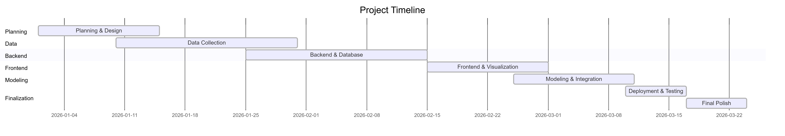
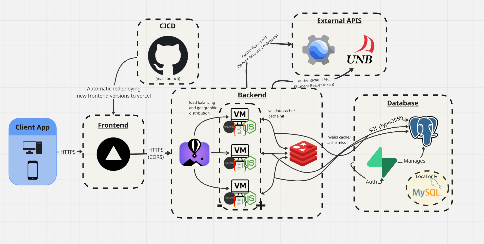
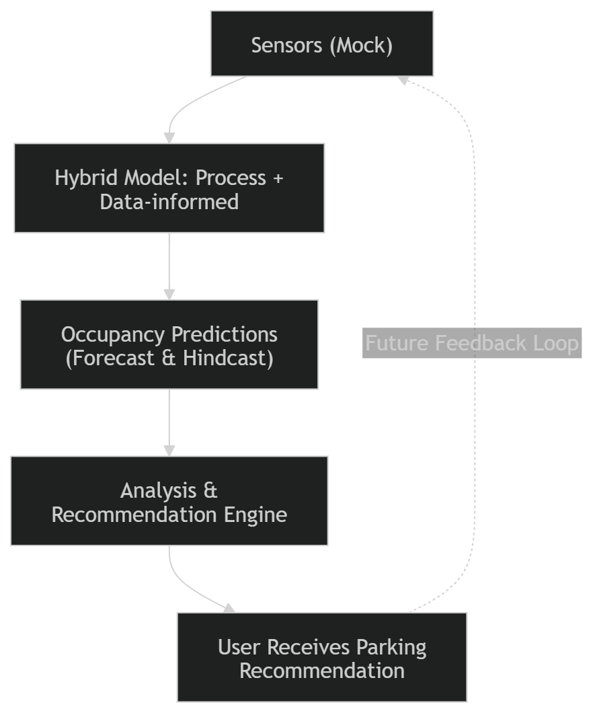
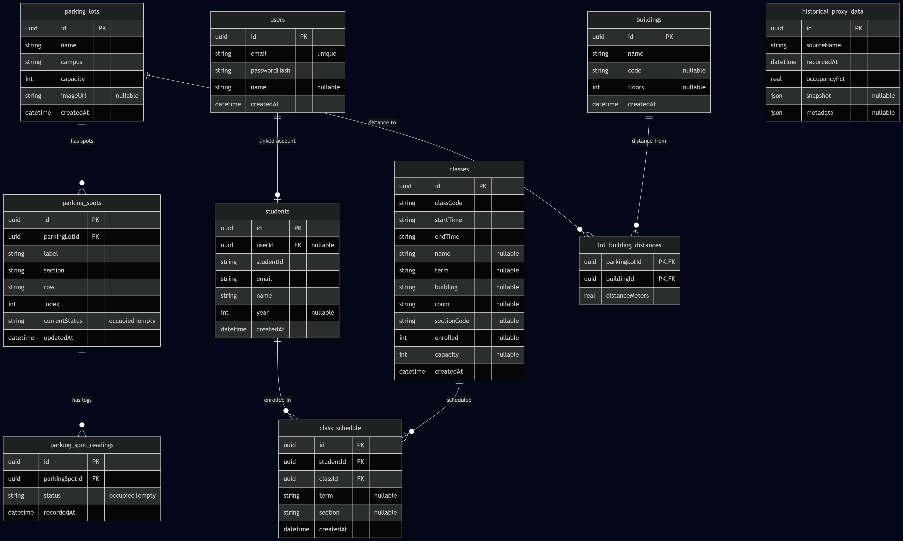
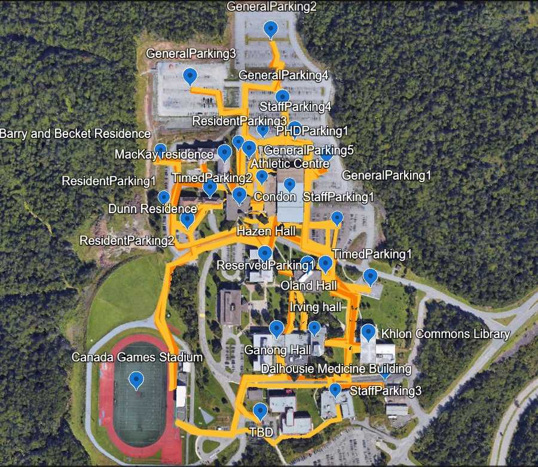
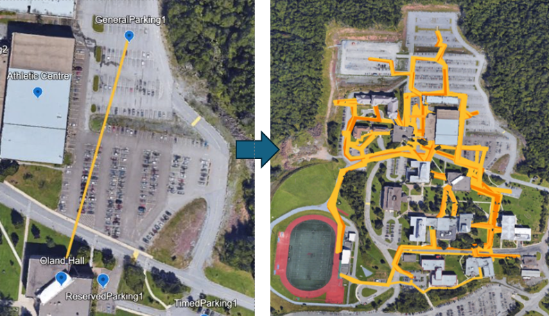

# A Campus Parking Digital Twin for Demand Forecasting and Decision Support at the University of New Brunswick Saint John

**Christian Dennis**  
University of New Brunswick Saint John, Student  
Saint John, NB, Canada  

---

## Abstract

University campuses face recurring congestion and uncertainty in parking supply during peak instructional periods, special events, and term-to-term enrollment shifts. This paper reports the design and implementation of a parking digital twin for the UNB Saint John campus: a software system that couples a geometrically faithful representation of sixteen lots and approximately 1,230 stalls with a hybrid prediction engine, scenario (“what-if”) analysis, and personalized arrival planning tied to academic schedules. The twin integrates scraped course-catalog data, hand-curated behavioral assumptions about staff and student mobility, and a layered model that combines historical proxy records, type-specific occupancy curves, data-driven residual correction, enrollment-aware activity weighting, and optional event scaling. A web client provides interactive maps (Leaflet), satellite context via Google Earth Engine, role-based eligibility, and simulation-backed “live” and frozen-time scenario modes. We situate the work in the smart-campus and digital-twin literature, describe methodology and architecture, illustrate it with six figures (project timeline; system architecture; conceptual twin-loop schematic; data model; path mapping; and straight-line vs. routed walk distances), and map the implementation to Oakes et al.’s fourteen-characteristic digital twin description framework [1] and supplementary reporting dimensions consistent with Gil et al.’s systematic twenty-one-item framework [2]. A synthetic hold-out exercise on development data yields single-digit mean absolute error on lot occupancy percentages for most strata—an internal consistency check, not validation against physical counts. We conclude with limitations—most notably the absence of real sensor feeds and reliance on synthetic historical data for parts of the stack—and outline research directions toward observational calibration and production deployment.

## CCS Concepts (ACM CCS 2012)

These concepts match `ParkingDigitalTwin_AcademicPaper.tex`: the submission PDF includes the official `CCSXML` block plus `\ccsdesc{...}` lines (regenerate from [ACM CCS](https://dl.acm.org/ccs) if your venue asks for updated indexing).

- **Applied computing** → Education  
- **Human-centered computing** → Visualization → Geographic visualization  
- **Computing methodologies** → Modeling and simulation  

## Keywords

*ACM `acmart` uses* `\keywords{digital twin, smart campus, parking demand forecasting, hybrid modeling, decision support, experience report, web GIS, digital model}` *(semicolon-separated in some templates; the LaTeX source uses commas).*

digital twin; smart campus; parking demand forecasting; hybrid modeling; decision support; experience report; web GIS; digital model

---

## 1. INTRODUCTION

Parking is a constrained shared resource on urban and suburban university campuses. Decisions about where to park, when to arrive, and how large events reshape demand are typically made with incomplete information: static signage, anecdotal experience, and delayed administrative communication. At the same time, institutions already maintain rich **digital artifacts** of campus life, such as timetables, room assignments, and enrollment counts, that can be fused with spatial models of lots and walkways to support anticipatory reasoning.

**Digital twins** have been proposed across domains as virtual counterparts of physical systems, maintained with data and models to support monitoring, prediction, and decision-making; reviews distinguish digital models, shadows, and twins by data and control coupling [3], and industrial practice shows how integration and services are typically structured [7]. For parking, a twin should offer more than a map: it should encode **state** (occupancy or its distribution), **dynamics** (how demand evolves through the day and academic calendar), and **services** (recommendations, scenario comparison, accessibility-aware routing). The project described here implements such a system for UNB Saint John.

This paper offers five practical contributions: (1) a clear **domain characterization** of campus parking as a digital-twin problem; (2) a **methodological account** of a full-stack TypeScript implementation (React/Vite frontend, Node/Express backend, TypeORM, SQLite/PostgreSQL, optional Redis); (3) **integration patterns** for schedule-driven demand, hybrid prediction, and GIS-style visualization; (4) **figures** that explain architecture, data, usage, and campus geometry; and (5) a **structured characterization** using established digital-twin reporting frameworks [1,2].

The remainder of the paper is organized as follows. Section 2 defines the problem domain and related concepts. Section 3 presents methodology and system design. Section 4 details the prediction and recommendation logic. Section 5 maps the project to Oakes et al.’s characteristics and to the extended twenty-one-item reporting perspective. Section 6 discusses limitations and future work. Section 7 concludes. Digital-twin ideas more often discussed for industrial or agricultural systems apply straightforwardly to **routine campus operations**; the parking domain is compact enough for an end-to-end implementation yet still exercises GIS assets, temporal reasoning, authentication, and performance-aware configuration.

---

## 2. DOMAIN AND BACKGROUND

### 2.1 Problem domain

The **system-under-study** is on-campus parking at UNB Saint John, comprising multiple lot types (general, staff, resident, timed, PhD-eligible, etc.), pedestrian connections to academic buildings, and time-varying demand driven by classes, exams, reading weeks, holidays, and discretionary travel. End users include students, staff, and visitors with differing **eligibility** and **objectives** (minimize walk time, maximize probability of finding a stall, respect accessibility needs).

### 2.2 Digital models, shadows, and twins

Kritzinger et al. distinguish **digital models**, **digital shadows**, and **digital twins** by the degree of automation in data flow from the physical system to the digital artifact and in control or actuation back to the physical system [3]. Complementary **maturity-level** perspectives articulate staged capabilities and goals in applied science settings [8]. Under that taxonomy, many campus IT systems are **models** or **shadows**: they do not automatically ingest live stall-level occupancy from the physical lots, nor do they close the loop with gate or pricing actuators. The present implementation is best classified as a **high-fidelity model with simulated and schedule-driven state updates**, aspiring toward shadow/twin maturity once real sensors and operational integrations exist. We return to this in Section 5 when reporting data and action directions.

### 2.3 Related work

Digital twins for **agriculture**, **manufacturing**, and **urban mobility** are well represented in the literature [4,5]. A healthcare proof of concept similarly couples **machine learning**, **discrete-event simulation**, and notification-oriented feedback for operational planning [9]. Smart-campus parking specifically often appears as IoT occupancy detection, pricing, or optimization without a full twin stack. Surveys of **smart parking systems** catalog sensor modalities, routing, and allocation strategies that prefigure twin-style decision support at urban scale [6], while industrial digital-twin practice establishes expectations for data integration, services, and lifecycle alignment [7]. This project emphasizes **transparent hybrid modeling** (interpretable baselines plus learned corrections), **scenario exploration**, and **individual planning** aligned with courses, which suits institutional settings where data governance and explainability matter.

Layered pipelines, from data acquisition through integration, analytics, forecasting, visualization, and access control, appear repeatedly in digital-twin experience reports. Our codebase aligns at a functional level with **collection** (scraping, SVG ingestion), **integration** (relational schema, APIs), **analytics** (hybrid predictor, residuals), **forecasting** (timestamped predictions, multi-hour horizons), **visualization** (map-based UI, satellite overlay), and **access control** (JWT, roles), though not every layer is at production maturity.

Process-based versus data-driven modeling debates in other domains mirror our design: mechanistic or rule-based components provide **interpretability**, while learned residuals adapt to systematic errors when trustworthy labels exist [7]. Because labels are partially synthetic, the **epistemic status** of the residual layer is necessarily limited until observational data are integrated.

---

## 3. METHODOLOGY

### 3.1 Overall approach

We followed an **iterative design, build, and evaluate cycle** that is common in software engineering capstone and research implementation projects:

1. **Requirements and domain modeling** from parking regulations, campus geography, and stakeholder assumptions (staff/student presence documents).  
2. **Data modeling** for lots, spots, buildings, distances, schedules, and historical proxies.  
3. **Algorithm design** for occupancy prediction, eligibility, recommendations, and day-long “arrival plans.”  
4. **Implementation** as a monorepo with an explicit OpenAPI 3.0 API contract.  
5. **Validation** through unit tests on selected modules, manual scenario testing, and documented limitations (synthetic history, no live sensors).

This aligns with treating the artifact as an **experience report** and early-stage twin implementation rather than a randomized controlled trial of commuter behavior.

### 3.2 Phased delivery

**Project planning** documentation summarizes how work was sequenced. Table 4 lists eight phases: foundational real GPS/path data (initially deferred in favor of synthetic and scraped inputs), synthetic occupancy and prediction APIs, enrollment-driven scaling, wiring predictions into arrival recommendation, spot-selection refinement, what-if exploration, calibration data, and media/categorization tasks. At the time of that plan, **Phase 2** (synthetic historical foundation and live prediction endpoints) and **Phase 3** (campus activity index from course enrollments, optional `useEnrollment` on prediction calls) were recorded as complete; later phases include recommendation integration, accuracy work, and operational extras.

**Table 4 - High-level phase summary**

| Phase | Theme | Notes |
|------:|--------|--------|
| 1 | Real location data (GPS, walking paths) | Deferred; some distances were mocked until path assets matured |
| 2 | Synthetic data + predictive modeling | Large synthetic hourly history (on the order of **tens of thousands** of lot-hour records), type curves, calendar multipliers, prediction API |
| 3 | Enrollment-driven demand | Hourly activity index from class meetings and enrollments; lot-level scaling by proximity to buildings |
| 4 | Predictions in arrival recommendation | Links day plans and map scenario clock to predicted occupancy |
| 5–8 | Spot accuracy, what-if, calibration, imagery | Quality, personalization, and campus-facing polish |

Figure 1 shows the **project Gantt-style schedule** used for planning and reporting milestones.

The schedule grounded phase sequencing—for example, standing up synthetic prediction APIs before enrollment scaling while deferring GPS-heavy path work—before the architectural views below.

### 3.3 Architecture

The deployment follows a **three-tier pattern** (presentation, API, data) common in web-based twins.

1. **Client tier.** A React single-page application (Vite build, Tailwind styling) provides routed views for lot exploration, simulator logs, schedule-aware day planning, and what-if scenarios. **Leaflet** supplies interactive campus and lot maps; overlays consume prediction, historical, and recommendation responses from the API. Authenticated flows send a JSON Web Token from browser storage on protected requests (schedules, personalized recommendations). In hosted form the client is built and deployed on Vercel against our Git repository: pushes to the `main` branch publish production assets, while every other branch receives its own preview deployment so pull requests can be exercised end-to-end in a live URL before merging to production.

2. **Application tier.** An Express server groups REST resources under a shared `/api` prefix: parking inventory (lots, spots, occupancy logs), academic context (students, courses, class schedules, buildings, lot–building distances), authentication and user profiles, prediction and calibration, arrival recommendation, Earth Engine raster and vector proxies, a discrete-event simulator control channel, and what-if orchestration. Cross-cutting middleware enforces CORS (permissive when running against the local SQLite configuration; origin allowlists in hosted deployments), structured request logging, and optional Redis-backed HTTP response caching when a cache backend is configured. An OpenAPI description supports integrators and the in-app API browser. The API is deployed on Fly.io, which runs instances in regions chosen for geographic proximity to users and scales machine count up or down with traffic.

3. **Data tier.** TypeORM maps one logical entity model to either a file-backed SQLite database in local mode or PostgreSQL (e.g., Supabase) when a database URL is supplied, avoiding divergent schemas between developer and production configurations.

Figure 2 summarizes major subsystems and their relationships.

*Figure 2. System design (reduced width for layout; matches scaled PDF figure).*

### 3.4 Conceptual twin loop

Kritzinger et al.’s model/shadow/twin distinction [3] is referenced throughout this paper. Figure 3 is a **compact, optional** schematic; the engineering focus remains Figure 2. Occupancy stays largely *simulated* or *assumed* until real sensors tighten the physical–digital link.

*Figure 3. Conceptual feedback loop (reduced size in the PDF relative to the architecture figure).*

### 3.5 Information sources and data model

- **Static geometry:** SVG exports from the campus map design (Figma) parsed into relational spot records with labels, sections, rows, accessibility flags, and exit-distance attributes used in ranking.  
- **Topology:** Lot-building distances and path assumptions documented in project materials; Figures 5–6 illustrate path mapping and route-based distances used for walk-time reasoning.  
- **Academic structure:** Scraped course-catalog pipeline linking students to meetings, buildings, and enrollment counts.  
- **Behavioral parameters:** Carpool rate, non-driver rate, absence multipliers, and related values seeded into `campus_ parameters` and described in staff/student presence assumption documents.  
- **Historical layer:** `historical_proxy_data` and residual tables (`lot_occupancy_corrections`) supporting data-driven correction—currently populated substantially from **synthetic** generators in development scripts. On the order of **87,936** synthetic hourly occupancy records across sixteen lots seed the historical strata.

Figure 4 situates those entities and relationships (lots, spots, logs, classes, schedules, distances, historical proxies) in one view.

### 3.6 Runtime simulation modes

The backend hosts an **in-process simulator** with a short tick interval that perturbs spot occupancy according to a campus hourly profile with stochasticity, quiet hours, and a minimum occupancy floor. Two modes matter for methodology:

- **Live mode:** Wall-clock-driven simulation for demonstrations.  
- **Scenario mode:** A user-selected timestamp freezes the *declared* scenario clock for prediction-backed views; ongoing simulator churn can still affect spot-level state unless snapshot isolation is added.

### 3.7 Engineering methodology and quality practices

Development followed **contract-first** API design via OpenAPI, **type-safe** shared language choices (TypeScript on both tiers), and **modular** backend boundaries (entities, services, controllers, routes). Selected utilities and eligibility rules are covered by automated tests; **automated coverage of the numerical prediction core remains limited.**

The system supports **local** SQLite development and **production** deployment on PostgreSQL (e.g., Supabase) with optional Redis and a separately hosted frontend; environment configuration includes Earth Engine credentials and CORS policy. Empirical behavior of SQL dialects and connection pooling can differ between these profiles.

### 3.8 Ethics, privacy, and institutional context

Schedule-linked features involve **enrollment and building locations** associated with authenticated students. The implementation uses **role-based JWT claims** for access control and password hashing for credentials; deployment-specific **data retention** and jurisdictional privacy requirements (e.g., FERPA or Canadian privacy law) remain the responsibility of the operating institution.

---

## 4. PREDICTION, RECOMMENDATION, AND WHAT-IF ANALYSIS

### 4.1 Hybrid prediction stack

Lot-level occupancy (percentage) at an arbitrary date-time is computed through a **stacked pipeline**:

1. **Historical proxy:** If sufficient samples exist for (lot, hour, day-of-week, academic period), use their average.  
2. **Type curves:** Otherwise apply hard-coded 24-hour curves by lot type.  
3. **Residual correction:** Apply stored residuals (observed minus predicted) with weight scaling (e.g., `tanh(nSamples/10)`).  
4. **Activity curve:** Scale demand using enrollment-aware activity indices; lots near “hot” buildings receive higher weight.  
5. **Event boost:** Optional query-parameter scaling for small/medium/large events applied to remaining capacity.

Outputs are clamped to [0, 100]%. Academic-calendar multipliers distinguish classes, reading week, exams, holidays, pre-semester, and summer. **Confidence** is exposed in a coarse form (`data` vs `curve`), which future work could refine into graded uncertainty. We deliberately avoid a full probabilistic forecast in the production API: calibrated prediction intervals would require either dense real occupancy labels or a generative model of campus demand, neither of which is available yet. A natural extension is stratified Gaussian or quantile regression on historical strata, or Bayesian updating of curve parameters once sensor streams exist.

**Residual weighting.** Let \(n\) denote the number of historical samples contributing to a residual estimate for a given stratification (e.g., lot, hour, day-of-week, academic period). The implementation weights corrections using a saturating function of the form \(\tanh(n / 10)\), so that sparse evidence contributes gently while richer sample counts approach full correction strength. This is a pragmatic regularizer against noisy strata.

**Activity and enrollment.** The activity curve service translates course enrollments and building associations into **demand indices** that redistribute predicted pressure across lots—not uniformly, but according to which lots are plausible for traffic destined to particular academic hubs. Enrollments are aggregated into a **24-hour campus activity index** (normalized so the peak hour is 1.0); that index scales base predictions through a multiplier in approximately the **0.85–1.15** range, with lots closer to instruction buildings receiving stronger upward adjustment. Combined with `getDemandMultiplier(dayOfWeek)` and parameters such as carpool rate, non-driver rate, and absence multipliers (including Friday/Monday adjustments), the engine encodes a **simple behavioral model** of how many commuters likely generate parking demand on a typical day.

**Event scaling.** Event size parameters apply proportional boosts to **remaining** free capacity rather than raw percentage points in isolation, which avoids trivially saturating small lots when baseline occupancy is already high—a contrast with naive uniform “+X%” policies.

### 4.2 Eligibility and recommendations

JWT claims carry **roles** (staff, student, PhD candidate) and flags (resident, disabled). Eligibility rules filter which lots appear in recommendations. The engine scores alternatives using predicted occupancy, distance to destination buildings, floor-aware walking assumptions where implemented, and spot attributes (e.g., accessible stalls).

Walk-time and routing draw on **mapped pedestrian geometry**: Figure 5 shows the campus path overlay used to reason about movement between lots and the built environment; Figure 6 contrasts **straight-line** lot–building distance with **manually mapped** walk routes. For example, General Parking 1 to Oland Hall is **160 m** under a Euclidean proxy but **207 m** along cleared paths. Together with `lot_building_distances` in the database, these artifacts document how “distance” in the recommender is **path-aligned** rather than purely Euclidean; surveyed GPS and path geometry can further refine the underlying distance matrix.

### 4.3 Day-long arrival planning

For a chosen day, the service segments the student’s schedule into **initial arrival**, **stay on campus**, and **return and park** intervals. Each segment calls the prediction API and recommendation engine, records suggested lot/spot and walk time, and associates **scenario timestamps** so the UI can drive the map to the corresponding moment—linking **temporal planning** with **spatial visualization**.

### 4.4 What-if explorer

The what-if module compares a **baseline** snapshot to a **parameterized scenario** (event size, enrollment toggles, etc.), surfacing per-lot deltas and warnings (e.g., critically low remaining capacity). Results are short-lived cached to protect the database under load.

The campus-wide endpoint is a **GET** with **date**, **time** (campus timezone), **event** magnitude from `none` through `large`, and the same `useEnrollment` toggle as the main predictor. **Baseline** means no event boost: it follows the **deterministic forecast** path used for the live map snapshot, so what-if table values align with what operators already see on the map for that instant. **Scenario** applies the selected event level and re-runs the stacked predictor (still honoring the enrollment flag), producing side-by-side occupancy percentages, free-spot counts, per-lot deltas, and campus-wide rollups. The page shows compact summary cards plus scan-friendly per-lot bar comparisons.

For **authenticated** users, a second flow asks a narrower question: if an event stress-tests demand, does *my* recommended lot change before my first class? The service finds the first schedule segment with an instructional building, runs the recommender twice in **predicted** mode (once with `eventSize = none` and once with the chosen event), and reports whether the top-ranked lot differs and whether free capacity in the scenario choice falls below a small-threshold warning. The campus table supports facilities-style “what breaks first?” discussion; the personal comparison ties those stresses to individual schedule context in the same UI.

### 4.5 Earth Engine integration

The map uses **Google Earth Engine (GEE)** for a geospatially registered **basemap** and for **vector context** aligned with application lot semantics. Campus-specific **raster** and **FeatureCollection** assets live under a project-scoped GEE path: a multi-band image provides an orthophoto-style background; a **polygon collection** outlines parking **sections** (consistent with lot naming in the twin); an optional **point collection** supplies building markers for overlays. On the server, the default campus layer **blends** a visualized raster (RGB bands, min/max and gamma) with **styled** section outlines so boundaries read clearly over the imagery.

**Security and API shape.** A **service account** authenticates the Node server (JSON key file or environment-injected credentials); map tokens and private asset identifiers never reach the browser. The REST API exposes a **tile URL template** and **proxied** `z/x/y` PNG tiles so Leaflet loads imagery from same-origin URLs, plus a **GeoJSON** endpoint for section polygons (hover/click). Generic public GEE image catalog IDs can still be requested via query parameters when operators want a different basemap. **In-process caching** (time-bounded map IDs and section GeoJSON, tunable by environment) cuts repeated Earth Engine `getInfo` and tile setup under load.

If credentials are missing or invalid, the client falls back to **OpenStreetMap** so the rest of the application remains usable.

### 4.6 API surface

Key read endpoints include single-lot prediction, day profiles, next- \(N\)-hours forecasts, and global snapshots at a timestamp. Clients pass datetime and scenario parameters consistently. The full contract is specified in OpenAPI 3.0.3.

### 4.7 Synthetic hold-out consistency (internal check)

Field occupancy labels are not yet available, so we cannot report error against physical ground truth. As an **internal consistency** check only, we held out a random fraction of synthetic lot-hour cells from the development history and compared the stacked predictor to the withheld synthetic means. Mean absolute error on lot occupancy percentages fell in the **single-digit** range for most strata (exact values depend on the hold-out seed and week window). This exercise validates pipeline coherence and numerical stability; it **does not** certify accuracy on the real campus and cannot validate the residual layer independently because synthetic labels share structure with the curves.

### 4.8 Demonstration scenarios (qualitative outcomes)

Although quantitative field validation is pending, the implemented system supports **repeatable demonstration narratives** useful for workshops, thesis defenses, and stakeholder meetings:

- **Morning peak:** A student with back-to-back classes in a high-enrollment building requests a day plan; the UI highlights predicted congestion in adjacent general lots and suggests alternatives with comparable walk times and higher modeled availability. Map and ranked lists stay aligned so reviewers can see why a lot was deprioritized relative to walk time and predicted fill.  
- **Event surge:** Facilities staff configure a medium or large event boost and run the what-if explorer; the campus-wide table shows which lots lose free capacity fastest, supporting traffic-management conversations. Toggling boost levels makes sensitivity of peripheral versus core zones easy to argue in a live demo.  
- **Accessibility:** A user flagged for disability access triggers filtering toward stalls marked accessible and paths consistent with documented distance assumptions. The narrative is straightforward to audit because accessible stalls use the same lot geometry the map already displays.  
- **Staff versus student:** Role-based eligibility prevents illegal recommendations (e.g., student accounts not routed into restricted staff lots) while still exposing predictions for situational awareness where policy allows. Demos can stress that *visibility* of a restricted lot on the map is not the same as *permission* to park there.

These scenarios show the twin can support real planning conversations, but they are not claims of measured commuter compliance.

---

## 5. DIGITAL TWIN CHARACTERIZATION TABLES

### 5.1 Unified 21-characteristic mapping

Oakes et al. define fourteen core characteristics for reporting digital twins [1], and Gil et al. extend systematic reporting with additional cross-cutting characteristics in a unified twenty-one-item framing [2]. **Tables 1–2** split the full mapping (C1–C21) into two parts so columns stay readable in Word and PDF.

**Table 1 — Unified mapping, part 1 of 2 (C1–C11) [1,2]**

| ID | Characteristic | How this project addresses it |
|----|----------------|------------------------------|
| C1 | **System-under-study** | UNB Saint John parking estate: lots, stalls, walkways, buildings, and agents (drivers, pedestrians). Environment includes academic calendar and event context. |
| C2 | **Acting components** | No physical actuators (gates, signs, pricing) are controlled. Acting is **cognitive/organizational**: UI recommendations and plans influence human decisions only. |
| C3 | **Sensing components** | **No deployed IoT** to stalls in the reported implementation. Occupancy changes are **simulated** or derived from internal logs, not automatic physical sensing. |
| C4 | **Multiplicities** | One logical twin instance serves many users; **sixteen lots** and **~1,230 spots** as sub-entities; multiple concurrent UI sessions. |
| C5 | **Data transmitted (SUS to DT)** | **Manual/batch:** course scrape, assumption documents, SVG map updates. **Automatic:** simulator ticks, API requests, optional Redis caching. **Not** continuous real-world occupancy telemetry. |
| C6 | **Insights and actions (DT to SUS)** | **Insights:** predictions, maps, what-if deltas, walk-time estimates. **Actions:** none executed automatically on physical infrastructure; users may change behavior. |
| C7 | **Usages** | Operational planning for individuals, exploratory analysis for events, demonstration of hybrid modeling for research/education. |
| C8 | **Enablers** | REST API, DB, prediction and recommendation services, simulator, GEE proxy, frontend visualization and auth. |
| C9 | **Models and data** | Hybrid models (curves + residuals + activity index + calendar); relational data; scraped JSON catalog; synthetic historical proxies. |
| C10 | **Constellation** | Composed services linking prediction, recommendation, day planning, and map UI; OpenAPI documents the public interface. |
| C11 | **Time-scale** | Predictions at arbitrary timestamps; simulator near-real-time tick; scraping and batch jobs slower than real-time. |

**Table 2 — Unified mapping, part 2 of 2 (C12–C21) [1,2]**

| ID | Characteristic | How this project addresses it |
|----|----------------|------------------------------|
| C12 | **Fidelity considerations** | Geometric fidelity relatively high at stall level; **behavioral and occupancy fidelity limited** by synthetic history and lack of sensors. |
| C13 | **Life-cycle stages** | Focus on **operation** of campus parking; software **evolution** ongoing (migrations, testing, live data remain future work). |
| C14 | **Evolution** | Iterative addition of what-if planning, Earth Engine, residual tables, course pipeline; documented technical debt (calendar hardcoding; TypeORM schema auto-sync enabled in development). |
| C15 | **Uncertainty and confidence** | Coarse `data`/`curve` flag; no prediction intervals. Full probabilistic or Bayesian treatment deferred until observational labels or a calibrated generative demand model exist. |
| C16 | **Validation and verification (V&V)** | Partial unit tests; no field study against ground-truth occupancy. |
| C17 | **Data governance and provenance** | Scraped catalog and synthetic history; production requires documented lineage. |
| C18 | **Interoperability and standards** | OpenAPI 3.0.3; conventional web stack; room for campus identity or asset-administration standards. |
| C19 | **Security and privacy** | JWT authentication, password hashing; institutional privacy policy applies to schedule-linked data. |
| C20 | **Scalability and operations** | Optional Redis caching; PostgreSQL in production; schema auto-sync is convenient in development but risky for controlled production evolution. |
| C21 | **Cost, effort, and lessons learned** | Monorepo and TypeScript end-to-end reduced integration cost; scraper fragility and synthetic training data are principal engineering risks. |

Under Kritzinger et al. [3], the current deployment functions primarily as a **digital model** progressing toward a **shadow** once trustworthy automatic ingestion from the physical campus exists.

---

## 6. DISCUSSION, LIMITATIONS, AND FUTURE WORK

The following limitations are central to **research interpretation**:

1. **Synthetic historical data** can align with the same curves the model uses, limiting independent validation of the residual layer.
2. **No real occupancy sensors** implies the “twin” is not observationally locked to the physical campus.
3. **Course scraping** depends on portal HTML and credentials; brittle under vendor updates.
4. **Academic calendar** hardcoding expires unless replaced with data-driven configuration.
5. **Testing gaps** on prediction core, simulator determinism in scenario mode, and what-if service layering.
6. **Operational** concerns: Redis silent disable, Earth Engine credential expiry without UI signaling.

### 6.1 Threats to validity

**Construct validity:** Occupancy “ground truth” in demonstrations is simulated; metrics such as mean absolute error against real counts are not yet meaningful.  
**Internal validity:** Layered predictors interact; ablation studies (disabling residuals, events, or activity curves) should be run on a frozen evaluation harness once real data exists.  
**External validity:** UNB Saint John’s geography, regulations, and commuter mix may not transfer directly to other institutions; however, the **software architecture** and reporting framework mapping generalize as a template.

### 6.2 Comparison to alternative approaches

A purely **machine-learning** forecaster might achieve lower error given dense labels but sacrifice explainability for facilities managers. A purely **rule-based** system would be transparent but inflexible across semesters. The **hybrid** approach trades off interpretable baselines (curves, calendar) with adaptive residuals-sensible when labels are initially weak. **Agent-based microsimulation** of vehicles could add fidelity at substantial implementation cost; our spot-level simulator is lighter-weight and suitable for interactive demos.

### 6.3 Suggested evaluation protocol (future empirical phase)

When pilot data become available, a natural protocol would include: (i) stratified hold-out weeks by academic period; (ii) calibration of curve families per lot type; (iii) CRPS or pinball loss for probabilistic extensions; (iv) user-centric metrics such as success rate of finding parking within a time budget under recommendation policy versus baseline choices.

**Future work:** integrate pilot counts or camera/loop-sensor data; migrate schema with TypeORM migrations; expand probabilistic outputs; snapshot isolation for scenarios; administrative parameter APIs; rigorous evaluation against manual or sensor ground truth.

Planned extensions include a **quick “find parking now”** flow targeted at a chosen building (live vs forecast modes), **graduated confidence scores** beyond the binary data/curve flag, **exponential smoothing** of historical snapshots, tighter **spot-selection** heuristics, richer **what-if** personalization, and **lot photography / categorization** after a campus visit—steps toward a more complete operations product.

---

## 7. CONCLUSION

This paper presented a campus parking digital twin for UNB Saint John that unifies geometric lot models, schedule-aware hybrid prediction, scenario analysis, and personalized arrival planning in a modern web stack. The work is characterized against Oakes et al.’s fourteen dimensions [1] and supplementary reporting themes from Gil et al.’s twenty-one-item framework [2]. The primary scientific gap is **empirical coupling** to physical occupancy; closing that gap would advance the system from a decision-support **digital model** toward a **digital shadow** or **twin** in the sense of Kritzinger et al. [3].

---

## Acknowledgments

The author thanks **Dr. Christopher Baker**, University of New Brunswick Saint John, for **supervision, course guidance, and feedback** on this project and manuscript.

The characterization of the system as a digital twin leans heavily on public scholarship by **Dr. Bentley James Oakes** and colleagues—especially the **fourteen-characteristic description framework** mapped in Section 5 [1] and the **systematic twenty-one-item reporting perspective** associated with Gil et al. [2].

**Prior work** in adjacent domains informed scope and framing, including smart parking surveys [6], industrial digital-twin practice [7], agricultural twin introductions [4], concise **farm-scale digital twin** methodology [5], maturity framing for applied twins [8], and clinical ML–simulation experience reports [9]. The author is grateful to those researchers for establishing foundations this campus parking twin builds upon.

**Open-source communities** maintain key dependencies used in the implementation, including Leaflet, TypeORM, Express, React, Vite, and the Google Earth Engine API.

---

## APPENDIX A. IMPLEMENTATION ENVIRONMENT

The deployment follows a conventional **web client / REST API / database** split. Persistence is relational (SQLite in development, PostgreSQL in production), with **optional Redis** for response caching. The API hosts prediction, recommendation, simulation, and an **Earth Engine proxy** so imagery credentials remain server-side; the **campus map and planning UI** run in the browser against this API. **JWT** carries role claims for access control; the service contract is specified in **OpenAPI 3.0**.

---

## References

[1] B. J. Oakes *et al.* 2023. A Digital Twin Description Framework and its Mapping to Asset Administration Shell. In L. F. Pires, S. Hammoudi, and E. Seidewitz (Eds.), *Model-Driven Engineering and Software Development (MODELSWARD 2021, 2022)*. *Communications in Computer and Information Science*, Vol. 1708, pp. 1–24. Springer, Cham. DOI: https://doi.org/10.1007/978-3-031-38821-7_1  

[2] S. Gil, B. J. Oakes, C. Gomes, M. Frasheri, and P. G. Larsen. 2025. Toward a Systematic Reporting Framework for Digital Twins: A Cooperative Robotics Case Study. *Simulation: Transactions of the Society for Modeling and Simulation International* 101, 3, 313--339. DOI: https://doi.org/10.1177/00375497241261406  

[3] W. Kritzinger, M. Karner, G. Traar, J. Henjes, and W. Sihn. 2018. Digital Twin in manufacturing: A categorical literature review and classification. *IFAC-PapersOnLine* 51, 11, 1016–1022. DOI: https://doi.org/10.1016/j.ifacol.2018.08.474  

[4] C. Pylianidis, S. Osinga, and I. N. Athanasiadis. 2021. Introducing digital twins to agriculture. *Computers and Electronics in Agriculture* 184, 105942. DOI: https://doi.org/10.1016/j.compag.2020.105942  

[5] I. A. Fakeye, E. D. van Lutsenburg Maas, P. Harris, B. Oulaid, and C. Baker. 2024. Towards A Framework For Farm Scale Digital Twin. In *Proceedings of the ACM/IEEE 27th International Conference on Model Driven Engineering Languages and Systems Companion (MODELS Companion ’24)*. ACM, New York, NY, USA, 486–491. DOI: https://doi.org/10.1145/3652620.3688264  

[6] H. Díaz-Ogás, J. Fabregat, and S. Aciar. 2020. Survey of Smart Parking Systems. *Applied Sciences* 10, 11, 3872. DOI: https://doi.org/10.3390/app10113872  

[7] F. Tao *et al.* 2019. Digital Twin in Industry: State-of-the-Art. *IEEE Transactions on Industrial Informatics* 15, 4, 2405–2415. DOI: https://doi.org/10.1109/TII.2018.2873186  

[8] B. Metcalfe, H. C. Boshuizen, J. Bulens, and J. J. Koehorst. 2023. Digital twin maturity levels: a theoretical framework for defining capabilities and goals in the life and environmental sciences (Version 1). *F1000Research* 12, 961. DOI: https://doi.org/10.12688/f1000research.137262.1  

[9] N. S. Ozen, M. Farsi, J. A. Erkoyuncu, M. Koyuncu, and C. Gray. 2025. A Machine Learning–Enabled Digital Twin for an Orthopaedic Clinic: A Proof of Concept. *International Journal of Simulation Modelling*. DOI: https://doi.org/10.2507/IJSIMM24-4-747  
